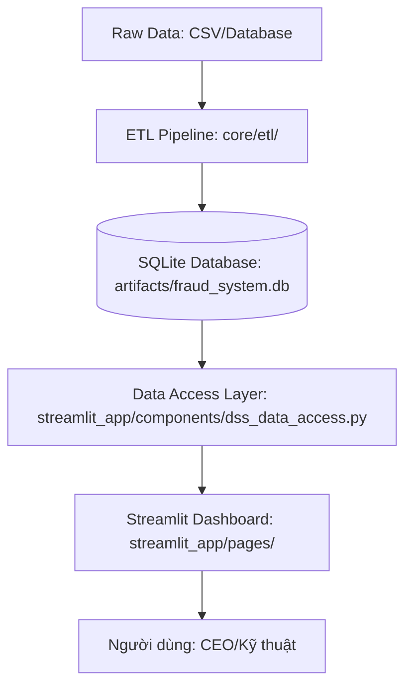

# Hệ Thống Phát Hiện Gian Lận Thẻ Tín Dụng - Tài Liệu Kỹ Thuật Cho Đối Tác

Tài liệu này được thiết kế dành cho các đối tác kỹ thuật để hiểu sâu về kiến trúc, phương pháp triển khai dữ liệu và cách thức xây dựng Dashboard phân tích (DSS) trong hệ thống. Mục tiêu là giúp đối tác có thể tái lập (reproduce) hoặc tích hợp các module tương tự vào hệ thống của mình.

---

## 1. Tổng Quan Kiến Trúc & Workflow

Hệ thống được xây dựng theo mô hình **Modern Data Stack** rút gọn, tập trung vào tính tương tác cao và khả năng phản hồi thời gian thực.

### 1.1 Luồng Xử Lý Dữ Liệu (Data Flow)



1.  **ETL Layer**: Chuyển đổi dữ liệu thô thành các bảng tổng hợp (Aggregated Tables) để tối ưu hóa hiệu suất truy vấn của Dashboard.
2.  **Storage Layer**: Sử dụng SQLite với các bảng được tối ưu cho việc truy vấn theo thời gian (year, month) và phân đoạn (region, segment).
3.  **Access Layer (DAL)**: Một lớp trung gian (Abstraction Layer) giúp tách biệt logic truy vấn SQL khỏi logic hiển thị của Streamlit, cho phép thay đổi Database mà không cần sửa code UI.
4.  **Presentation Layer**: Sử dụng Streamlit kết hợp với Plotly để tạo ra các biểu đồ tương tác và các thành phần UI tùy chỉnh (Custom Components).

---

## 2. Hướng Dẫn Triển Khai ETL Pipeline (Data Engineering)

Mỗi module ETL không chỉ đơn thuần là nạp dữ liệu mà còn chứa các thuật toán **Synthetic Data Generation** để mô phỏng các kịch bản kinh doanh thực tế (MoMo-like scale).

### 2.1 Module Giao Dịch (load_paysim.py)
*   **Mục tiêu**: Mô phỏng luồng tiền và tỷ lệ gian lận theo vùng miền và thời gian.
*   **Logic Tinh Chỉnh Thông Số**:
    *   **Tăng trưởng (YoY Growth)**: Áp dụng `year_factor = 1.0 + (year - 2023) * 0.15` để mô phỏng sự phát triển 15% mỗi năm của ngành Fintech.
    *   **Tính mùa vụ (Seasonality)**: Sử dụng hàm Sine `1.0 + 0.1 * np.sin((month - 1) * np.pi / 6)` để tạo biến động $\pm 10\%$ theo các tháng trong năm (ví peak vào các dịp lễ).
    *   **Biến động vùng miền (Region Variance)**: Sử dụng `region_weights` (Miền Nam 50%, Miền Bắc 30%, Miền Trung 20%) và `region_volume_multipliers` để tạo sự khác biệt về quy mô GMV giữa các vùng.
    *   **Gian lận (Fraud Rate)**: Áp dụng `base_fraud_rate * region_multiplier`. Ví dụ: Miền Trung có multiplier 1.2 (tỷ lệ cao hơn 20% so với trung bình).

### 2.2 Module Tín Dụng (load_credit.py)
*   **Mục tiêu**: Quản lý danh mục cho vay và nợ xấu (NPL).
*   **Logic Phân Tầng (Segmentation)**: Chia khách hàng thành 6 nhóm (GenZ, Sinh viên, NV Văn phòng, Kinh doanh, Hưu trí, Tiểu thương) với các tham số khác biệt:
    *   **Hạn mức (Credit Limit)**: Nhóm Tiểu thương có hạn mức cực cao (80M) so với Sinh viên (3M).
    *   **Rủi ro (NPL Rate)**: Nhóm Sinh viên có NPL cao (4.2%) so với NV Văn phòng (1.5%).
*   **Tính toán dòng tiền**: `total_outstanding` được tính bằng `users * limit * 0.6` (mô phỏng tỷ lệ sử dụng hạn mức 60%).

### 2.3 Module Marketing (load_marketing.py)
*   **Mục tiêu**: Theo dõi hiệu quả chuyển đổi phễu (Funnel).
*   **Thông số Kênh (Channel Params)**:
    *   **TikTok**: Volume lớn nhất nhưng CAC (Cost per Acquisition) cao nhất (~80K).
    *   **Referral**: Tỷ lệ chuyển đổi (Conversion Rate) cao nhất (~25%) nhưng Volume thấp nhất.
*   **Công thức tính toán**:
    *   `Acquisitions = Impressions * Conversion_Rate`
    *   `Campaign_Spend = Acquisitions * CAC`
    *   `LTV_Estimated = CAC * (1 + ROI/100)`

### 2.4 Module Đối Tác & Anomaly (load_merchant.py)
*   **Mục tiêu**: Phát hiện các tài khoản "Merchant ẩn" (Personal accounts có volume lớn).
*   **Thuật toán phát hiện bất thường (Anomaly Score)**:
    *   Đối với tài khoản cá nhân (Personal), nếu `monthly_volume > 100M VND`, hệ thống sử dụng phân phối `Beta(5, 2)` để tạo ra `anomaly_score` cao $\rightarrow$ Đánh dấu rủi ro.
    *   Ngược lại, sử dụng `Beta(1, 5)` để tạo score thấp.

---

## 3. Hướng Dẫn Triển Khai Dashboard (Frontend & Data Science)

Dashboard được xây dựng trên **Streamlit**, sử dụng **Plotly** cho các biểu đồ và **Custom CSS** để đạt được giao diện chuyên nghiệp (Dark Mode, Glassmorphism).

### 3.1 Thành Phần UI Tùy Chỉnh (Custom Components)
Để đảm bảo tính thống nhất, chúng tôi không dùng trực tiếp các hàm Streamlit gốc mà thông qua `shared_ui.py`:
*   `render_kpi_card()`: Sử dụng HTML/CSS để tạo các thẻ hiển thị số liệu với đổ bóng (box-shadow) và màu sắc trạng thái (delta up/down).
*   `render_ceo_command_panel()`: Sử dụng `st.session_state` để mô ph phản hồi các chỉ thị của CEO một cách tức thời.

### 3.2 Chi Tiết Triển Khai Các Biểu Đồ (Visualization Logic)

#### A. Phân tích Phễu (Conversion Funnel) - [Module 1]
*   **Công nghệ**: `plotly.graph_objects.Funnel`.
*   **Logic**: Lấy dữ liệu từ 3 tầng: `Impressions` $\rightarrow$ `Clicks` $\rightarrow$ `Registrations`.
*   **Tuning**: Sử dụng `textposition="inside"` và `hovertemplate` để hiển thị tỷ lệ % so với bước đầu tiên, giúp CEO thấy ngay điểm "rơi rụng" khách hàng lớn nhất.

#### B. Dự báo Tăng trưởng (Growth Forecasting) - [Module 1 & 4]
*   **Công nghệ**: Compound Growth Model.
*   **Logic**: 
    *   Tính toán tốc độ tăng trưởng lịch sử (Historical Growth Rate).
    *   Sử dụng các phân vị (Quantiles: 25th, 50th, 75th) để tạo ra 3 kịch bản: **Thận trọng (Conservative)**, **Cơ bản (Baseline)**, và **Tích cực (Optimistic)**.
    *   Công thức dự báo: $Customers_{next} = Customers_{current} \times (1 + rate)^{n}$.
*   **Visualization**: `go.Bar` kết hợp với màu sắc gradient để phân biệt các kịch bản.

#### C. Ma trận BCG (BCG Matrix) - [Module 3]
*   **Công nghệ**: `plotly.express.scatter`.
*   **Logic Phân Loại**: Dựa trên trung vị (Median) của hai trục:
    *   **Trục X**: Số lượng khách hàng sử dụng (`support_count`).
    *   **Trục Trình**: Doanh thu (`revenue`).
    *   **Phân loại**:
        *   **Star (Ngôi sao)**: Doanh thu $\ge$ Median AND Users $\ge$ Median.
        *   **Cash Cow (Bò sữa)**: Doanh thu $\ge$ Median AND Users $<$ Median.
        *   **Question Mark (Dấu hỏi)**: Doanh thu $<$ Median AND Users $\ge$ Median.
        *   **Dog (Chó)**: Doanh thu $<$ Median AND Users $<$ Median.
*   **Visualization**: Bubble chart với kích thước bong bóng (`size`) tỷ lệ thuận với doanh thu.

#### D. Biểu đồ Đồng hồ Nợ xấu (NPL Gauge) - [Module 2]
*   **Công nghệ**: `plotly.graph_objects.Indicator`.
*   **Logic**: 
    *   Thiết lập dải màu (Steps): `0-3% (Green)`, `3-5% (Yellow)`, `5-10% (Red)`.
    *   Đặt một `threshold` tại mốc 3% để cảnh báo sớm.

---

## 4. Hướng Dẫn Vận Hành (Operations Guide)

### 4.1 Cài đặt môi trường
```powershell
# Tạo môi trường ảo
python -m venv .venv
.\.venv\Scripts\Activate.ps1

# Cài đặt dependencies
pip install -r requirements.txt
```

### 4.2 Quy trình chạy hệ thống
Để khởi động toàn bộ hệ thống, thực hiện theo thứ tự sau:

1.  **Khởi tạo Database & Nạp dữ liệu (ETL)**:
    Chạy script `run_all_etl.py` hoặc chạy riêng lẻ từng module theo thứ tự:
    ```powershell
    python core/etl/load_paysim.py
    python core/etl/load_credit.py
    python core/etl/load_marketing.py
    python core/etl/load_cskh.py
    python core/etl/load_merchant.py
    python core/etl/load_review_queue.py
    ```

2.  **Khởi chạy Dashboard**:
    ```powershell
    python run_dashboard.py
    ```
    Truy cập qua địa chỉ: `http://localhost:8501`

### 4.3 Lưu ý quan trọng 
*   **Data Integrity**: Khi nạp dữ liệu từ CSV bên ngoài, hãy đảm bảo tên cột được chuẩn hóa (ví dụ: `conversion_rate` thay vì `conv_rate`) hoặc sử dụng tính năng tự động mapping của hệ thống.
*   **Performance**: Các bảng DSS đã được aggregate. Nếu muốn phân tích ở mức độ giao dịch thô (Granular level), cần cấu hình lại Data Access Layer để kết nối trực tiếp với nguồn dữ liệu gốc.
*   **Scaling**: Hệ thống hiện tại sử dụng SQLite. Khi triển khai thực tế cho hàng triệu giao dịch/ngày, cần chuyển đổi lớp `dss_data_access.py` sang sử dụng PostgreSQL hoặc BigQuery.

---
